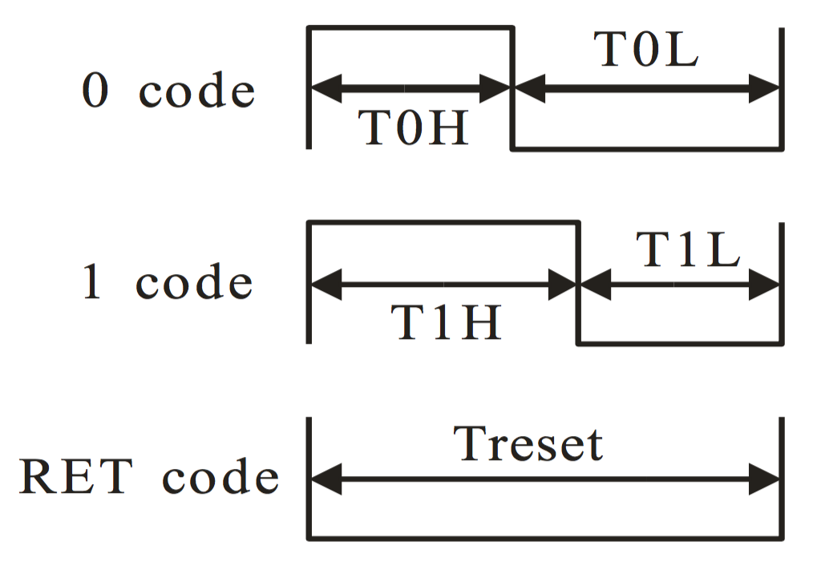

 
 
 
 
 
 
 
 
 
 
 
 
 
 
 
 
 

#Software zu Powerspy

####1. Pinlayout (v. 1.4)

|  Port|   I/O| AN/DIG|  Pin#|   Analog/Digital|             Benutzung|                           Note|
|-----:|-----:|------:|-----:|----------------:|---------------------:|------------------------------:|
|   RA0|    IN|     AN|    17|              AN0|      Current Phase IN|                         COMP 2|
|   RA1|    IN|     AN|    18|              AN1|      Voltage Phase IN|                         COMP 1|
|   RA2|    IN|     AN|     1|              AN2|    REF for Curr Phase| input reference for Curr Phase|
|   RA3|   OUT|    DIG|     2|              AN3|         Display Latch|                               |
|   RA4|   OUT|    DIG|     3|              AN4|           Display CLK|                               |
|   RA5|     -|      -|     4|                -|PICKit programmer con.|                   master clear|
|   RA6|   OUT|    DIG|    15|                -|            Status LED|                               |
|   RA7|   OUT|    DIG|    16|                -|          Display DATA|                               |
|   RB0|   OUT|    DIG|     6|                -|                   PWM|    generate REF for Curr Phase|
|   RB1|    IN|    DIG|     7|             AN10|          Bluetooth RX|                               |
|   RB2|   OUT|    DIG|     8|              AN9|          Bluetooth TX|                               |
|   RB3|    IN|    DIG|     9|              AN8|                Button|                               |
|   RB4|    IN|     AN|    10|              AN7|      Voltage Value IN|      will probably not be used|
|   RB5|    IN|     AN|    11|              AN5|      Current Value IN|                        use ADC|
|   RB6|     -|      -|    12|              AN6|PICKit programmer con.|        nur als programmier Pin|
|   RB7|     -|      -|    13|                -|PICKit programmer con.|        nur als programmier Pin|
|   VDD|     -|      -|    14|                -|          Power supply|                               |
|   VSS|     -|      -|     5|                -|          Power supply|                               |

####2. Strommessung
Für die Strommessung wird ein dedizierter Chip verwendet, der ACS712.
Dieser Liefert in Abhängigkeit vom Strom eine Spannung von 0.5 bis 4.5 Volt, wenn er mit 5V betrieben wird.
Da er allerdings auch mit nur 4.5V oder 5.5V betrieben werden kann, kann dieses Limit ein offset von ±0.5V bekommen.
Wenn man nun eine Geradengleichung annimmt für:

I(U) = k*x + d 
mit I(0.5V) = -20A 
und I(4.5V) = +20A
                  
kommt man auf Folgende Funktion, um die Spannung in den Strom umzurechnen:

I(U) = 10U - 25

Da der Strom gleichgerichtet wird, kann er jeder zeit abgefragt werden.

####3. Spannungsmessung
Für die Spannungsmessung ist ein Anschluss reserviert, sie wird jedoch voraussichtlich nicht implementiert.
Alle Rechnungen werden daher mit dem für Europa fixen 230V Wert ausgeführt.

####4. Phasenmenssung
Der Phasenwinkel wird mithilfe der Zeitdifferenz ermittelt. Die Formel hierfür lautet: **phi = 2\*pi\*f\*delta_t**
Um diese Zeiten zu Messen wird **Timer 1** benutzt, da er 16 bit hat, und somit eine genügend hohe Auflösung erzielt werden kann.
Die Zeitdifferenz muss bei beiden Signalen am Nulldurchgang abgegriffen werden. 
Hierzu muss eine Referenzspannung für das Signal des Stromes und der Spannung angelegt werden.
Da aus der Spannung ein Rechtecksignal gemacht wird kann der FVR buffer benutzt werden, er ist ausreichend genau.
Bei dem Strom kann jedoch keiner benutzt werden, es muss eine eigene Referenz generiert werden.
Dies geschieht mithilfe einer PWM an die ein **Tiefpass 2. Ordnung** angeschlossen wird, um das Signal zu glätten.
Hierfür muss die Frequenz der PWM um circa das **20-Fache** höher sein, als das Tau der Tiefpasses, um eine Glättung zu gewährleisten.
Da die Frequenz der PWM jedoch nicht der des uControllers entspricht, muss zuerst errechnet werden, auf welcher Frequenz der Controller laufen muss.
Nach der Formel:

PWMPeriod = (PRx+1)\*4\*1/FOSC\*(TMRx Prescale Value)
$$PWMPeriod=(PRx+1)*4*\frac{1}{FOSC}*TMRxPrescaleValue$$

welche auf Seite 209 im Datenblatt zu finden ist.
Mithilfe dieser Formel ist es leicht sich die Frequenz des Controllers auszurechnen. Setzt man PWMPeriod gleich *15kHz*, so kommen **16MHz** für den Controller
heraus. Daraus folgen folgende Werte für den Tiefpass: R=10kOhm, C=220nF.

####5. Kommunikation mit der Statusled
Da die Statusled (WS2812B) eine sehr genaue Zeit braucht, um die Daten zu übermitteln wird schlussendliche eine Frequenz von 32MHz gebraucht.

Maximale Abweichung der Zeiten: **±150ns**

4/FOSC ≤ 150ns ------> **FOSC = 32MHz**

Um eine logische 0 oder 1 an den LED-driver zu schicken, muss *eine Kombination aus einem High-Low-Signal* erzeugt werden, wobei die Gesamtlänge
der Übertragung konstant ist und die High-time varriert wird.

Die Zeiten sehen wie folgt aus:

|Bezeichnung|Zeit/ns|Toleranz/ns|Tick cnt\*|
|----------:|------:|----------:|--------:|
|        T0H|    400|       ±150|        3|
|        T0L|    850|       ±150|        7|
|        T1H|    800|       ±150|        6|
|        T1L|    450|       ±150|        4|
|      RESET|≥50 000|       ±150|      400|

\*Bei 32MHz Oszillator Frequenz

Um eine Farbe an die LED zu schicken und diese somit auf jene Farbe zu programmieren, muss ein **GRB** code, bestehend aus **24 Bit** an diese gesendet werden. Das heißt, dass eine jede Farbkomponente genau 1 byte groß ist.
Die Farben werden nach der Reihe, beginnend mit dem MSB gesendet.

Um den Programmierzyklus der LED neu zu starten, muss eine Wartezeit von **50us** abgewartet werden.